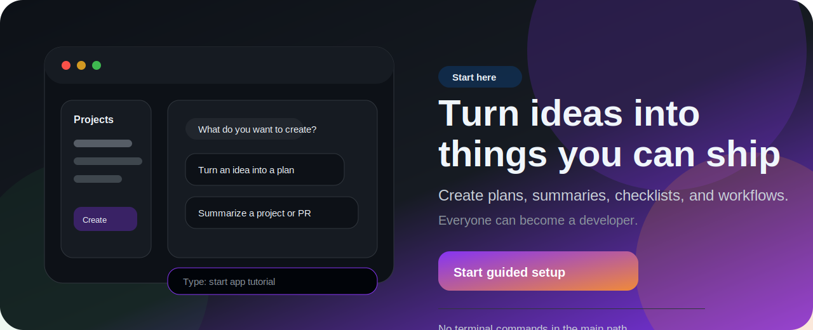
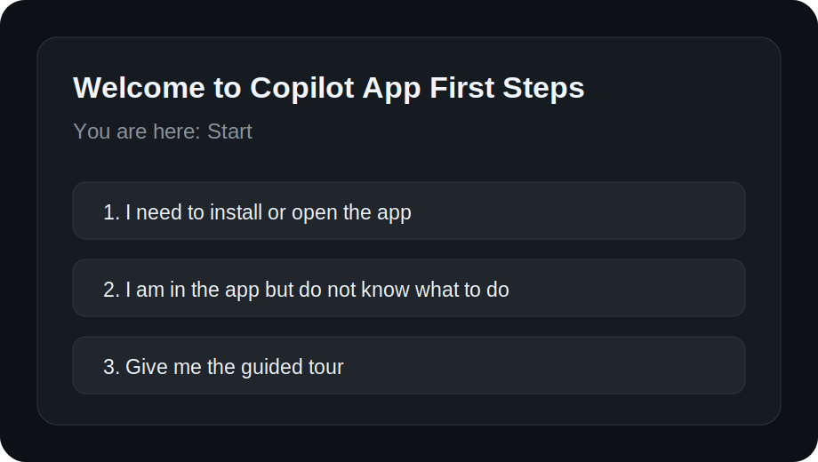
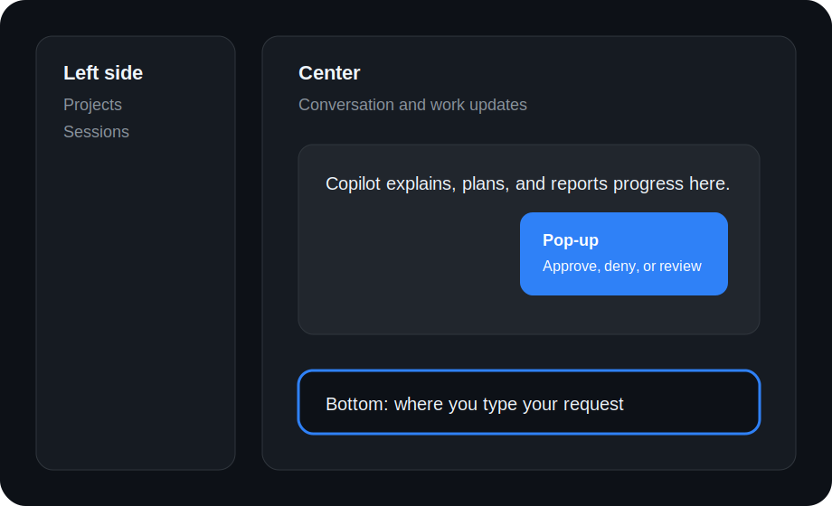
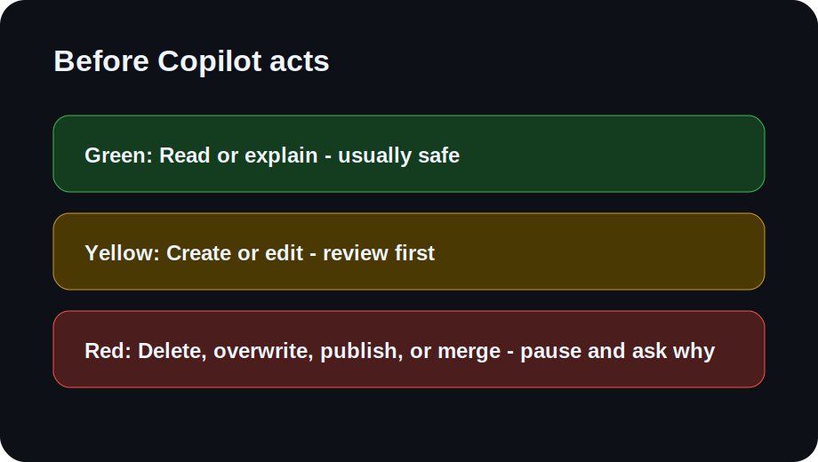

# Copilot App First Steps

[](LICENSE)
[](SECURITY.md)

<p>
  
</p>

> A guided, beginner-friendly tutor that helps non-technical users understand the value of the GitHub Copilot app by creating something useful. Everyone can become a developer.

## Start here

Discovery page:

https://dubsopenhub.github.io/copilot-app-first-steps/

If you are brand new, use the button below.

<p>
  <a href="https://dubsopenhub.github.io/copilot-app-first-steps/install.html">
    
  </a>
</p>

This opens the simple start page, copies the tutor phrase, and helps you create your first useful workflow:

```text
start app tutorial
```

No terminal commands are required for the main path.

## Who this is for

This is for non-technical or first-time users who want to understand what the GitHub Copilot app can help them create without needing to understand Git, branches, pull requests, terminals, or developer jargon first.

Good fits:

- Product managers
- Designers
- Support teammates
- Managers
- Founders
- Operations partners
- Anyone curious about what the Copilot app can do

## What you can create

By the end, you will be able to create:

1. A natural-language project summary.
2. A checklist from a GitHub issue.
3. A non-technical pull request explanation.
4. A project plan before anything changes.
5. A status update from project context.
6. A first real workflow you can repeat.
7. Confidence that you can become a developer by learning to create with the app.

## The guided path

```text
Start -> Open app -> First prompt -> Projects -> Safety -> Workflows -> Issues/PRs -> Graduation
```

The tutor shows a "You are here" marker at every step.

## Visual tour

### Start menu



### App map



### Approval prompt model



## How to use the tutor

Open the Copilot app and type:

```text
start app tutorial
```

The tutor will ask one question at a time and guide you through the app.

## What makes this different

This starts from user value, not tool mechanics. It is specific to the GitHub Copilot app:

- Chat overlay
- Project sessions
- Issue sessions
- Pull request sessions
- Permission prompts
- Guided work
- Session navigation

The tutor explains everything in beginner language and keeps asking: "What can you create next?"

## Brand guidance

The design follows the [GitHub Copilot Brand Toolkit](https://brand.github.com/brand-identity/copilot): dark GitHub surfaces, GitHub blue primary actions, Copilot purple accents, clear product context, and no deprecated standalone Copilot logo hero.

The public page uses brand-inspired colors and GitHub dark surfaces, but it does not show raw brand guideline sheets or product lockup guidance to learners.

## Having trouble?

### I do not have the Copilot app installed

Go to the official Copilot app releases page:

https://github.com/github/app/releases

The app may require preview access depending on your account or organization.

### I opened the app but do not know what to type

Type this exact phrase:

```text
start app tutorial
```

### I see a login or access message

That usually means one of these is true:

- You need to sign in to GitHub.
- Your Copilot subscription is not active for this account.
- Your organization has not enabled Copilot app access yet.
- The app preview is not available to your account yet.

Ask your GitHub or organization admin if you are using a work account.

### I see a permission prompt

You are still in control.

```text
Green: Read or explain - usually safe
Yellow: Create or edit - review first
Red: Delete, overwrite, publish, or merge - pause and ask why
```

When learning, choose the safest option and ask Copilot to explain what it wants to do.

## For technical helpers

This package includes the skill in two locations:

```text
skills/copilot-app-first-steps/SKILL.md
.github/skills/copilot-app-first-steps/SKILL.md
```

Use whichever location your Copilot app or skill loader supports. The primary learner path should remain the one-click install page, not manual setup.

## Repository contents

This repo follows the same pattern as the other DUBSOpenHub Copilot skill projects:

- `README.md` - learner-facing start page
- `install.html` and `index.html` - one-click landing page
- `SKILL.md` - root skill entry for quick inspection
- `skills/copilot-app-first-steps/SKILL.md` - canonical skill package
- `.github/skills/copilot-app-first-steps/SKILL.md` - GitHub-discoverable skill copy
- `agents/copilot-app-first-steps.agent.md` - agent persona/config
- `agents/copilot-app-first-steps.md` - product/design notes for the tutor
- `SECURITY.md` - private vulnerability reporting policy
- `CONTRIBUTING.md` - contribution workflow
- `docs/QA_REVIEW.md` - latest QA review results
- `docs/workflows/validate.yml` - ready-to-activate package validation workflow
- `docs/workflows/pages.yml` - ready-to-activate Pages deployment workflow

Maintainer note: the workflow files are committed as templates under `docs/workflows/` because the token used to create the repo did not include `workflow` scope. Move them to `.github/workflows/` after refreshing auth with `workflow` scope.

## Package layout

```text
copilot-app-first-steps/
├── README.md
├── index.html
├── install.html
├── TESTING.md
├── AGENTS.md
├── SECURITY.md
├── CONTRIBUTING.md
├── CODE_OF_CONDUCT.md
├── LICENSE
├── agents/
│   ├── copilot-app-first-steps.agent.md
│   └── copilot-app-first-steps.md
├── assets/
│   ├── start-here.svg
│   ├── hero.svg
│   ├── install-button.svg
│   ├── app-map.svg
│   └── approval-prompt.svg
├── docs/
│   └── workflows/
│       ├── validate.yml
│       └── pages.yml
├── skills/
│   └── copilot-app-first-steps/
│       ├── SKILL.md
│       └── catalog.yml
├── .github/
│   └── skills/
│       └── copilot-app-first-steps/
│           └── SKILL.md
└── evals/
    └── copilot-app-first-steps/
        ├── eval.yaml
        └── tasks/
```

## One-click install note

This package does not invent an unsupported Copilot app URL scheme. `install.html` keeps the app install/open URL in one place so an official skill-install deep link can be added as soon as the app exposes one.

## How it was built

This tutor was designed from the patterns used across DUBSOpenHub Copilot skill repos, with special attention to non-technical onboarding, visual guidance, one-click entry, security posture, and beginner-safe permission education.

🐙 Created with 💜 by [@DUBSOpenHub](https://github.com/DUBSOpenHub) with the GitHub Copilot CLI.
